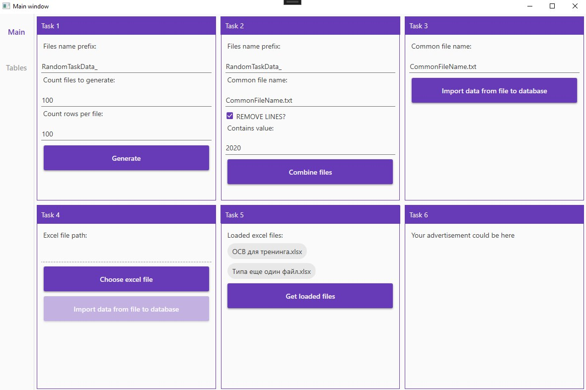
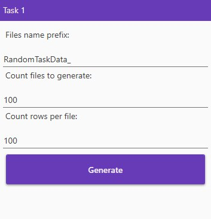
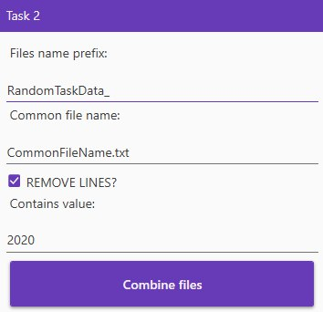
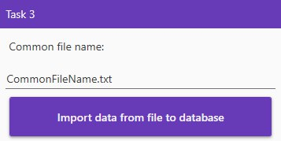
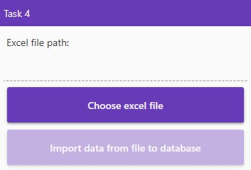
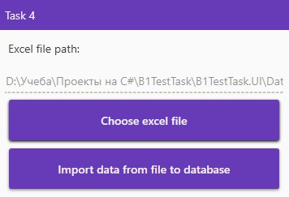
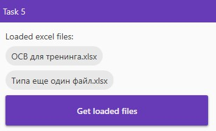
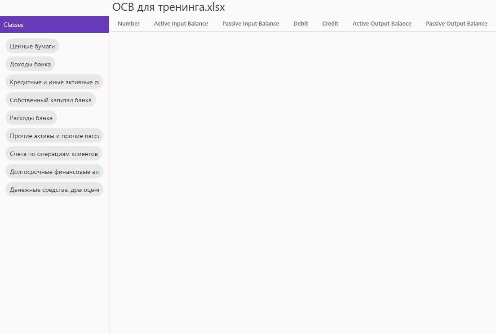
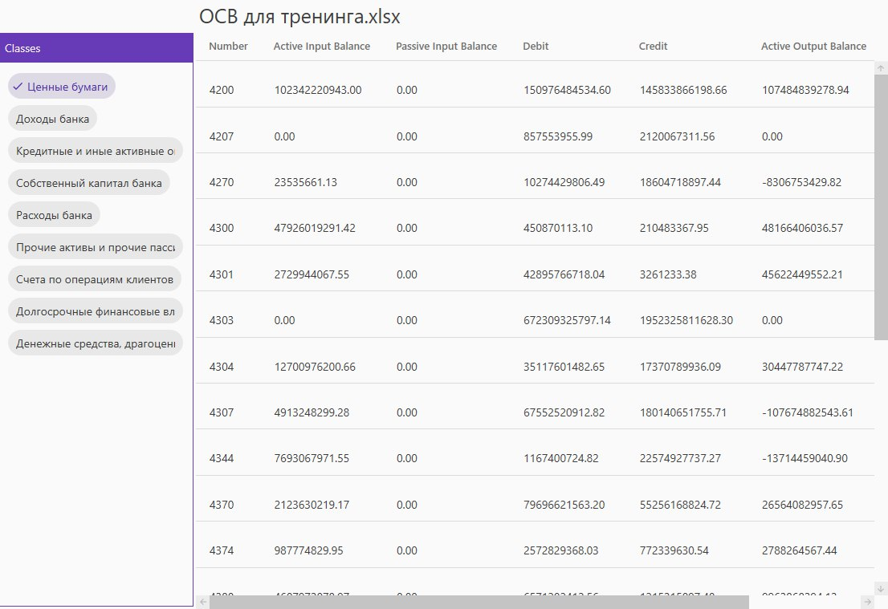

# B1TestTask

<h2>Гид по приложению</h2>

После запуска приложения отобразиться окно, разбитое на 6 частей, каждая из который представляет собой задание каждого таска:

<b>Задание 1:</b> Генерировать 100 текстовых файлов со следующей структурой, каждый из которых содержит 100 000 строк: случайная дата за последние 5 лет || случайный набор 10 латинских символов || случайный набор 10 русских символов || случайное положительное четное целочисленное число в диапазоне от 1 до 100 000 000   || случайное положительное число с 8 знаками после запятой в диапазоне от 1 до 20.

Здесь вы можете ввести параметры для генерации файлов: префикс для файлов, количество файлов для генерации, количество строк в каждом файле.

<b>Задание 2:</b> Объединять сгенерированные файлы в один. При объединении должна быть возможность удалить из всех файлов строки с заданным сочетанием символов, например, «abc» с выводом информации о количестве удаленных строк.

Здесь вы можете ввести параметры для объединения файлов: префикс для файлов, название общего файла, значение, при котором удалять строки, выбрать удалять ли записи содержащие значение. После объединения в заголовке окна отобразится статус и количество удаленных строк.

<b>Задание 3:</b> Импортировать данные из объединённого файла в БД. При импорте должен выводиться ход процесса (сколько строк импортировано, сколько осталось).

Здесь вы можете ввести параметры для объединения файлов: название общего файла. Во время импорта в заголовке окна будет отображаться информация о количестве импортированных строк, общем количестве строк и проценте импорта. После импорта в заголовке окна отобразится статус и время затраченное на импорт.

<b>Задание 4:</b> Переносить (поддерживать загрузку файлов такого формата) данные из excel-файла в СУБД.

Здесь вы можете выбрать Excel файл для импорта.

После открытия файла для импорта можно будет импортировать его в БД. После импорта в заголовке окна отобразится статус.

<b>Задание 5:</b> Отображать список загруженных файлов.

Здесь будет отображаться список всех загруженных файлов. По нажатию на файл будет открыта страница с классами данного файла. 

По нажатию на класс, в таблице будут отображены все банковские счета данного класса из текущего файла.

